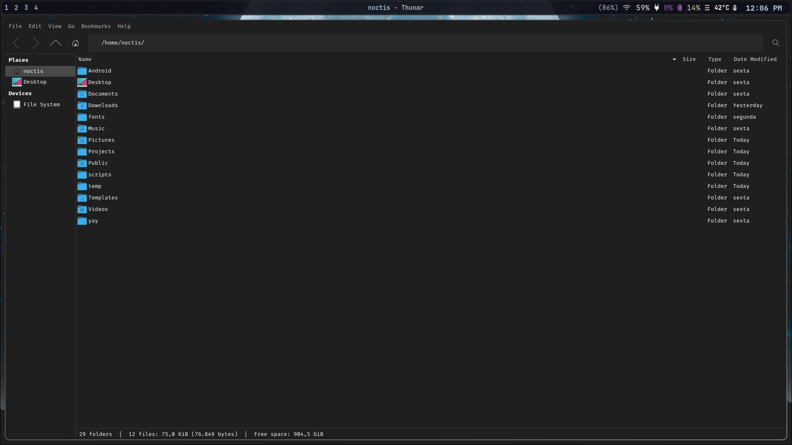
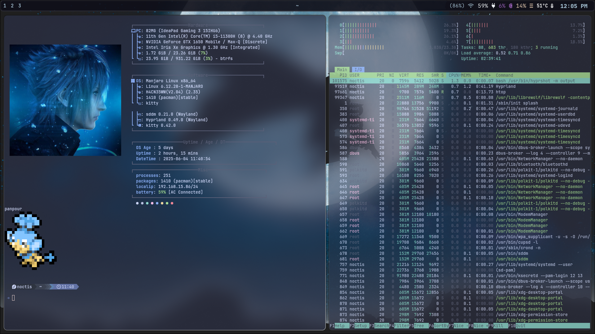
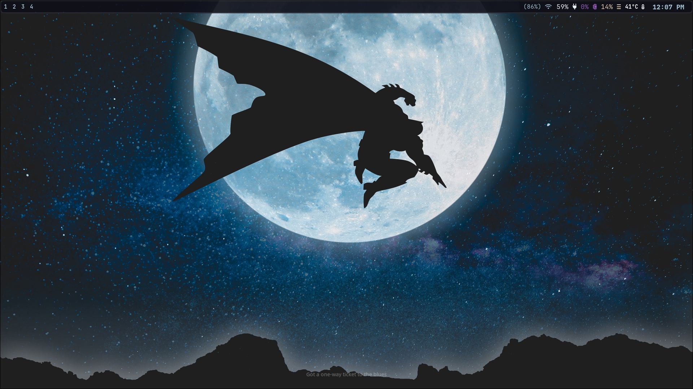

# Meu Rice no Manjaro Linux

Este repositório contém os **dotfiles** do meu *rice*. Focando na usabilidade e utilizando um setup minimalista.


## ✨ Destaques

- **Window Manager**: [Hyprland](https://github.com/hyprwm/Hyprland)
- **Barra de status**: [Waybar](https://github.com/Alexays/Waybar)
- **Terminal**: [Kitty](https://sw.kovidgoyal.net/kitty/)
- **Launcher/File Browser**: [Rofi](https://github.com/davatorium/rofi)
- **Notificações**: [Dunst](https://dunst-project.org/)
- **Prompt shell**: [Starship](https://starship.rs/)
- **Shell**: [Fish Shell](https://fishshell.com/)
- **Wallpaper/colorscheme**: [Pywal](https://github.com/dylanaraps/pywal) ou [Pywal16](https://github.com/eylles/pywal16) + [Matugen](https://github.com/Chivay/matugen)
- **Fetch tools**: [Fastfetch](https://github.com/fastfetch-cli/fastfetch)
- **File Manager**: Thunar


## 🎨 Mudança Automática de Tema
Para alterar automaticamente o esquema de cores do sistema, está sendo utilizado o **Pywal 16 colours**, no entanto, dependendo do seu OS, o **Pywal** convencional funcionará corretamente.
Basta executar:
```bash
wal -i /caminho/para/sua/imagem.jpg
```


## 🚀 Instalação

Clone o repositório em uma pasta de sua preferência:

```bash
git clone https://github.com/LuisGustavoDAlmeida/my_rice.git
cd my_rice
```
Você pode rodar o script dentro da pasta /script para mover os meus dotfiles automaticamente para a sua pasta .config, basta executar:
```bash
cd /scripts/
bash .install.sh
```
Ou você pode mover manualmente se preferir utilizando o cp


## 📸 Screenshots

### 🗂️ File Explorer (Thunar)


### 🏠 Homepage


### 🖼️ Wallpaper 



## ⚠️ Aviso

Este rice foi **testado e configurado especificamente no Manjaro Linux** com **Hyprland**.
 
Certifique-se de alterar todos os **paths que apontam para meu usuário** (`/home/seu-usuario/...`) para o seu próprio nome de usuário utilizando o seu editor de texto preferido, do contrário algumas funcionalidades não funcionarão corretamente.
